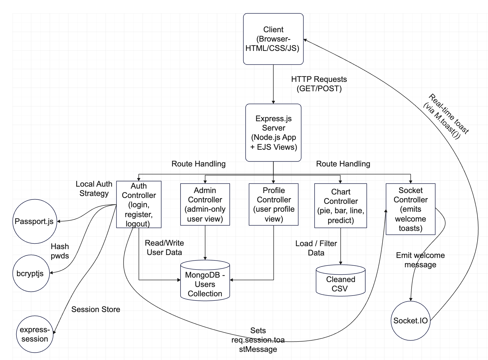

# FoodLens – Visualizing & Predicting Food Insecurity in Melbourne

**FoodLens** is a full-stack web application that empowers users to explore, analyze, and predict food insecurity trends using open government data from the City of Melbourne. It offers interactive visualizations, real-time feedback, and predictive analytics to support better decision-making for communities and policymakers.

---

## Features

- **User Authentication**
  - A landing Page view details of the app, and route to login/register
  - Register, Login, Logout via Passport.js
  - Admin and Normal User roles
  - Real-time welcome messages using Socket.IO
- **Interactive Dashboards**
  - Insecurity Types Pie Chart
  - Demographic-based Bar Charts
  - Combined Trends Comparison (Grouped Bar)
  - Insight Explorer (Multi-line by Category)
  - Future Trend Prediction via Linear Regression
- **Admin Panel**
  - View all registered users and their roles
  - Promote/Demote users
  - Clear individual user history
  - Export activity logs (CSV)
  - User activity tracking (last chart visited + filters)
  - Track active users and chart visits (Usage Analytics tab)
- **Testing**
  - Postman API test collection included
  - Chai , Mocha and Supertest unit testing
  - Manual testing checklist
- **Data Preprocessing**
  - Cleaned CSV data
  - Jupyter notebook for transformation & EDA
  - Seed script to import data into MongoDB

---

## Tech Stack

| Layer        | Technologies                                  |
|--------------|-----------------------------------------------|
| Frontend     | HTML, CSS (Materialize), Vanilla JS, Chart.js |
| Backend      | Node.js, Express.js                           |
| Database     | MongoDB + Mongoose                            |
| Auth         | Passport.js (Local), bcryptjs                 |
| Real-time    | Socket.IO                                     |
| View Engine  | EJS                                           |
| Data Parsing | csv-parser + Python (Jupyter Notebook)        |
| Testing      | Postman, Mocha, Chai, Supertest               |

---
## Dependencies

```

Category        : Packages
---------------------------------------------
Core            : express, mongoose, ejs, dotenv, csv-parser, csv-writer
Auth & Session  : passport, passport-local, bcryptjs, express-session
Real-time       : socket.io, express-socket.io-session
Testing         : mocha, chai, supertest
Dev Utilities   : nodemon

```

## Installation & Setup

### 1. Clone the Repository

```bash
git clone https://github.com/aniraj2020/foodlens.git
cd foodlens-app
```

### 2. Install Dependencies

```bash
npm install
```

### 3. Create a .env File

Create a `.env` file in the root directory and add your MongoDB URI (example below):

```
MONGO_URI=mongodb://localhost:27017/foodlens
```

### 4. Seed the Database

```bash
node seed/seedData.js
```

### 5. Run the App

```bash
npm run start
```

---

## Project Structure

```

foodlens-app/
├── assets/                               # Flowchart and visual assets
├── config/                               # DB config
├── controllers/                          # Modular route logic
├── models/                               # Mongoose schemas
├── routes/                               # Route handlers
├── public/                               # Static files (JS, CSS, logo)
├── seed/                                 # seedData.js for MongoDB import
├── views/                                # EJS UI templates
├── data/                                 # Cleaned CSVs
├── test/                                 # Mocha/Chai test folder
├── .env / .env.example                   # Environment variables
├── FoodLens API Tests.json               # Postman collection
├── test-results.txt                      # Output from Mocha + Chai + Supertest test suite
├── foodlens_data_preprocessing.ipynb     # Jupyter notebook for data preprocessing and EDA
├── FoodLens_Manual_Testing_Checklist_Fulfilled.xlsx
├── README.md
├── server.js                             # Main Express server entry point
├── package.json                          # Project metadata and dependencies


```

---

## Admin Access

- Super Admin: Created from backend
- Username: adminuser
- Password: adminpassword123

```

---
###  Backend Architecture Diagram



---
###  Trello Board

https://trello.com/b/p28xfmE7/foodlens

---

## License & Data Source

This project is built for academic (SIT725) and demonstration purposes. 
Data sourced from: [City of Melbourne Open Data Portal](https://data.melbourne.vic.gov.au/)

---

**Enjoy exploring FoodLens!**

---
